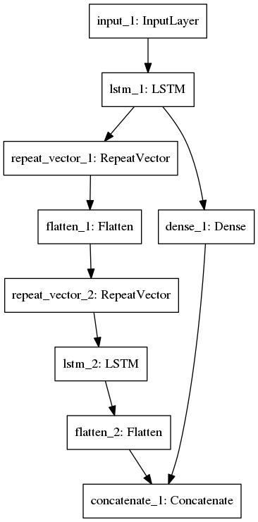
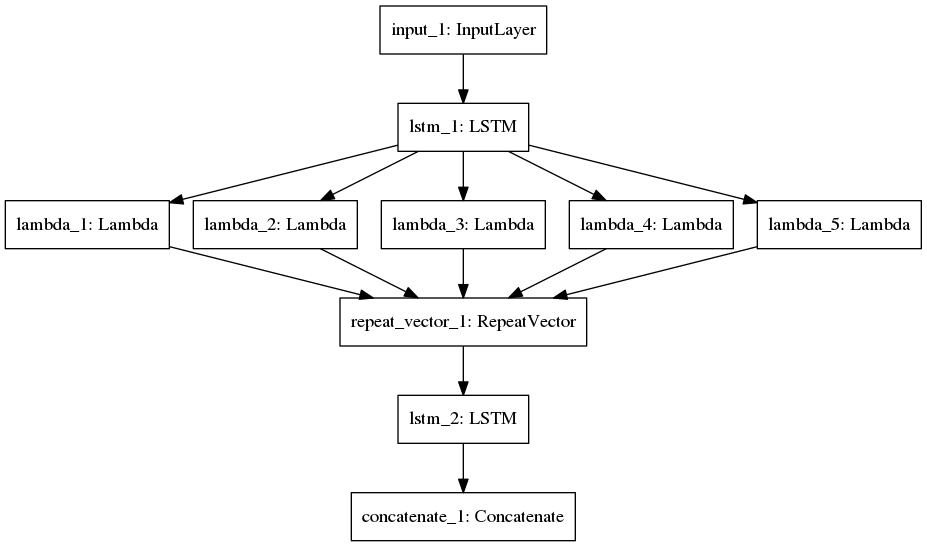

# DNNdumps

Some DNNs for getting a thesis.

## Autoencoder
- AE/autoencoder.py

## GAN
- GAN/gan.py

## RNN
- RNN/LSTM_AE.py: sequence-to-sequence autoencoder
- RNN/Stacked_LSTM.py: with stacked RNN layers
- RNN/PriorLSTM.py: adding first timestep of the output sequence as input
- RNN/LSTM_UNIT.py: coupled sequence-to-sequence autoencoder
- RNN/OptionLSTM.py: explode output into n modalities, match with the best modality
- RNN/Option_Prior_LSTM.py: encode also the output to learn the modality distribution
- RNN/OptionLSTM_VAE.py: same as previous, but using VAE
- RNN/HierarchicalLSMT.py: encode and decode sequence of multiple lengths
- RNN/OptionalHierarchical_LSMT.py: combining Option with Hierarchy

### Option LSTM

### Hierachical LSTM

### Points
- Training over all lengths increases the accuracy in finding the correct nearest neighbour using manhattan distance.
- Increasing the accuracy of the autoencoder increases is most crucial for getting good predictions.